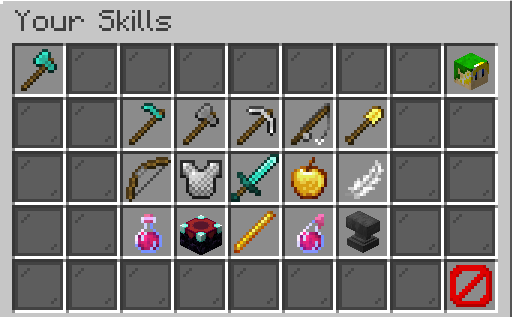
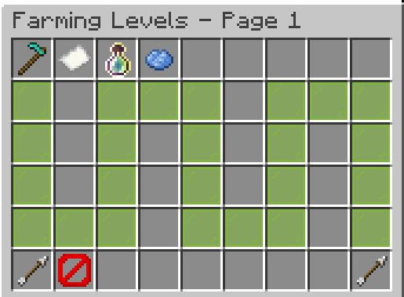
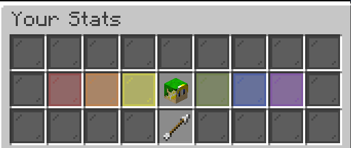

## Description

J'ai la flemme de détailler pour l'instant, mais en gros c'est le remplacant de McMMO sur le serveur.

## Skills

Les skills sont des talents que vous pouvez monter de niveau en pratiquant, et qui montent en échange vos stats et vous donnent accès à des compétences passives ou actives.
Vous pouvez accéder à la liste des skills à l'aide de `/skills`, vous tomberez alors sur cet écran :

Vous pouvez voir ici l'ensemble des 15 skills disponibles. Cliquez sur l'un d'eux pour accéder à son menu. Par exemple pour Farming :

Les icones sur la première lignes permettent respectivement de : voir un résumé de votre progression, voir votre classement pour ce skill, voir les moyens d'obtenir de l'xp, et consulter les compétences de ce skill.
La petite ligne colorée qui serpente sur votre écran est votre barre de progression, une case = un niveau, vous pouvez "scroll" avec les flèches.

Revenons au menu principal, si vous cliquez sur la tête de votre personnage en haut à droite vous aurez accès à vos statistiques :

Il existe 6 statistiques:
- Force (augmente vos dégats)
- Vie (augmente votre vie maximale)
- Regénération (augmente votre capacité de regénération naturelle)
- Chance (augmente votre chance globale et vos taux de drops)
- Sagesse (augmente le gain d'XP et réduit le coût à l'enclume)
- Résistance (réduit les dégats subits)

## Commandes

`/skills` : afficher l'interface pour voir votre progression dans tous les skills
`/skilltop` : ranking du total de niveau de skills
`/skillrank` : votre classement pour chacun des skills