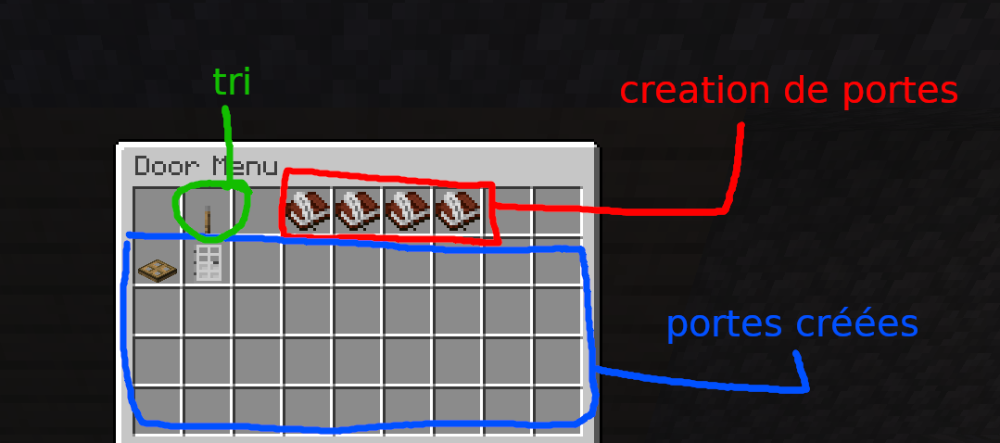
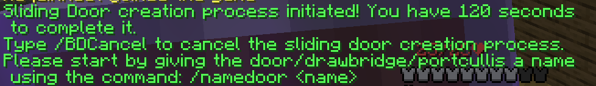
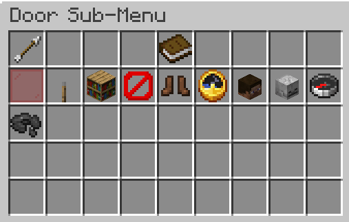

Vous permet de faire des ponts-levis, des portes sur charnieres et des portes coulissantes, le tout en blocs.

<iframe width="560" height="315" src="https://www.youtube.com/embed/ApawfmWX7Nw" title="YouTube video player" frameborder="0" allow="accelerometer; autoplay; clipboard-write; encrypted-media; gyroscope; picture-in-picture" allowfullscreen></iframe>

<iframe width="560" height="315" src="https://www.youtube.com/embed/v_geswl8_Ps" title="YouTube video player" frameborder="0" allow="accelerometer; autoplay; clipboard-write; encrypted-media; gyroscope; picture-in-picture" allowfullscreen></iframe>

## Tutoriel : Création d'une porte coulissante

Le processus de création d'une porte coulissante est similaire à celui d'un pont-levis, porte rotative, etc

Vous pouvez ouvrir le menu principal avec `/bdm`

La première icone sert à changer la méthode de tri pour l'affichage de vos portes, qui sont listées sur les 4 lignes suivantes.
Les 4 icones en haut à droite servent à démarrer les assistants de création de portes, il existe 4 types de "portes":
- drawbridge : pont-levis
- door : porte rotative/à charnière
- portcullis : porte coulissante verticale
- sliding door : porte coulissante horizontale

Une fois un des types de portes choisis, vous devrez nommer votre porte (c'est seulement utilisé pour se repérer parmi vos portes, choisissez un nom distinctif). Tapez `/namedoor NomDeVotrePorte` pour compléter cette étape.

Vous recevrez alors un baton/stick enchanté pour selectionner les deux coins de la porte, faites clic gauche avec le baton dans la main sur les deux coins de la porte.
Une dernière étape exclusive aux portes rotatives et pont-levis est la selection d'une "charnière", choisissez le côté de la porte qui doit servir de charnière en tapant dessus avec le baton.

Votre porte est finalement, créée, vous pouvez consulter son menu détaillé en cliquant sur l'icone correspondante à votre porte dans le menu `/bdm`

Quelques options importantes:
- levier: ouvrir/fermer la porte
- le Ø : supprimer la porte (le mécanisme, pas les blocs)
- les chaussures : supprimer le bloc d'activation de la porte (à sélectionner avec un baton qui vous est donné pour ça), pour fonctionner, le bloc doit être en or, et réagit à tout changement d'état de redstone
- la boussole : changer la direction d'ouverture de la porte

## Commandes

`/doors menu` : ouvre le menu avec toutes vos portes, la première ligne contient des boutons pour démarrer les assistants de création de portes/ponts-levis/etc

