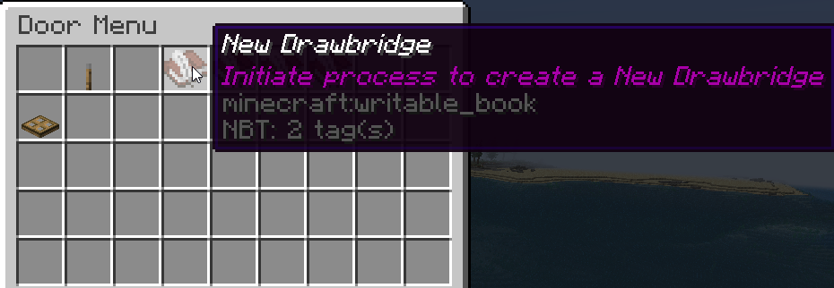

Vous permet de faire des ponts-levis, des portes sur charnieres et des portes coulissantes, le tout en blocs.

<iframe width="560" height="315" src="https://www.youtube.com/embed/ApawfmWX7Nw" title="YouTube video player" frameborder="0" allow="accelerometer; autoplay; clipboard-write; encrypted-media; gyroscope; picture-in-picture" allowfullscreen></iframe>

<iframe width="560" height="315" src="https://www.youtube.com/embed/v_geswl8_Ps" title="YouTube video player" frameborder="0" allow="accelerometer; autoplay; clipboard-write; encrypted-media; gyroscope; picture-in-picture" allowfullscreen></iframe>

## Commandes

`/doors menu` : ouvre le menu avec toutes vos portes, la première ligne contient des boutons pour démarrer les assistants de création de portes/ponts-levis/etc

