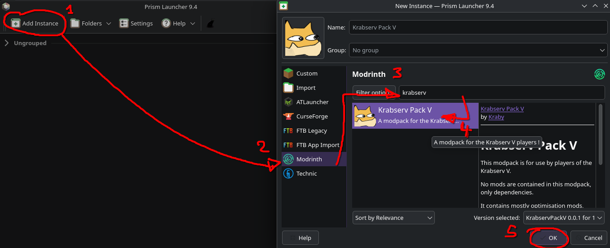

# Installation

### Launcher

Préférez le launcher [Prism](https://prismlauncher.org/download/windows/) à celui par défaut de minecraft. Il permet d'installer des mods et gérer des versions de minecraft très facilement !

### Mods

Je propose un **modpack** tout prêt à utiliser. Il n'est **pas nécessaire** (le serveur est **vanilla**). 

Le modpack contient plein de mods d'optimisation qui rendent le jeu plus agréable. Et il contient en particulier:

- **Simple Voice Chat** : permet d'avoir un chat vocal de proximité en jeu !
- **Distant Horizons** : permet de voir le paysage à des km de distance (le serveur vous envoie les info).

Pour l'installer depuis Prism Launcher, suivez le guide (ou [téléchargez-le ici](https://modrinth.com/modpack/krabservpackv)) :

Vous êtes libres d'utiliser les mods que vous voulez, du moment que ça n'inclut des mods de triche (type x-ray, freecam, autoclicker, etc). Vous pouvez désactiver les mods que vous voulez du modpack, son usage n'est pas obligatoire, même si je le conseille pour votre confort :)

# Systèmes de jeu

Résumé des changements:
- le système d'équipement a été revisité
- les monstres gagnent en puissance en s'éloignant du spawn
- 1 bloc dans le nether = 1 bloc dans l'overworld
- l'End est désactivé
- le monde a une world border de 2000x2000 blocs (temporaire)
- vous laissez des tombes en mourant, si vous tenez l'objet adéquat dans votre inventaire

Détail important : ne cassez pas les coffres des structures, leur contenu est regénéré aléatoirement, ce qui permettra à d'autres joueurs de les (re)looter plus tard.

### Progression personnelle et équipements

Tapez `/skills` pour voir la liste des skills que vous pouvez monter de niveau en jouant à minecraft, puis tapez `/stats` pour voir vos stats actuels. Chaque skills donne accès à quelques bonus, et permet de monter légèrement vos statistiques.

Vous possédez un niveau total qui correspond à la somme de tous vos niveaux de skills (voir [AuraSkills]({{ site.baseurl }})). Vous commencez niveau 1 à tous les skills, donc niveau 11 global. Certains outils et équipements ne peuvent s'utiliser qu'une fois votre niveau global augmenté. Les équipements que vous trouverez dans les coffres sont générés aléatoirement, et leur niveau minimal requis est toujours plus bas que celui des équipements que vous fabriquerez, profitez-en !

A la place des enchantements, chaque objet possède un certain nombre d'**emplacements de gemmes**. Les gemmes peuvent être fabriquées ou trouvée dans les coffres ou sur les monstres. Attention, les gemmes d'armure tendent à avoir des bonus *et* des malus... Equilibrez bien votre build, ou choisissez un build très spécialisé avec des faiblesses évidentes, à vous de voir.

### Progression du serveur

Ca reste à déterminer, mais le serveur aura plusieurs événéments/défis/collaborations pour débloquer de nouvelles fonctionnalités (Comme débloquer des magasins, des quêtes, des mobarena, ou étendre la taille maximale de la map !)