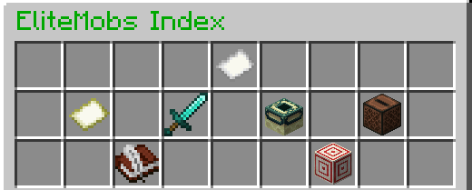
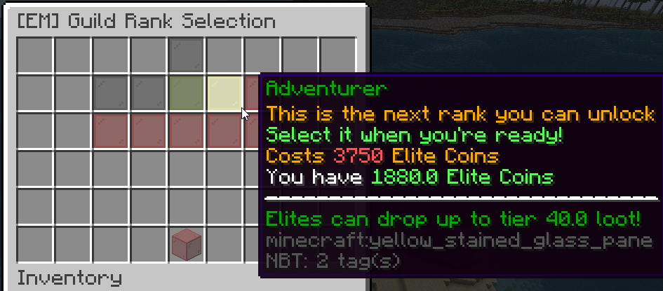

Tuez des mobs super puissants, droppez des items rares surpuissants, tuez des mobs encore plus puissants.

## Principe

EliteMobs permet de rajouter des mobs plus puissants (des "Elites") et des drops randoms d'équipements sur ces derniers. Les items sont soit générés aléatoirement, soit créés à la main par votre crabe préféré (dans lequel cas ils auront sûrement un skin unique ;) ).

Toute la partie "Elite" du jeu est assez self-contained:
- Les équipements qui font beaucoup de dégats aux Elites ne font beaucoup de dégâts qu'aux Elites (mais bien sûr les enchantements normaux qui sont dessus fonctionnent sur tous les monstres)
- Le spawn de ces mobs et leur niveau ne dépend que de vous, il vous est possible de désactiver le spawn d'Elites autour de vous et de jouer sans (mais ce serait dommage :) )

Il y a pour l'instant deux façon principales de rencontrer des Elites : par spawn naturel, ou par événements aléatoires.
Dans les deux cas, le niveau de l'Elite dépendra de l'équipement que vous portez. Vous pouvez facilement voir votre "niveau" (qui dépend donc SEULEMENT de votre équipement) en appuyant sur TAB (liste des joueurs en ligne). Le niveau prend en compte tous les équipements portés ainsi que l'arme tenue en main.

Les objets lâchés par les Elites peuvent contenir des enchantements qui n'existent pas dans le jeu de base, qui possèdent des effets spéciaux, ou des combinaisons d'enchantements impossibles en vanilla.

Les Elites droppent toujours des équipements aux alentours de votre niveau, vous pourrez ainsi graduellement acquérir de meilleurs armes et armures. Puisque les Elites risquent de vous coller des dégats assez importants, la durabilité des armures n'est perdue qu'à la mort. Seule contrainte (et pas des moindres) : tous les drops d'armes et d'armures vous sont liés, et ne peuvent pas être portés par les autres.

Pour continuer à rencontrer des Elites plus forts, il faudra payer en Elite Coin l'accès au rang supérieur, vous pouvez voir votre rang actuel à côté de votre niveau en affichant la liste des joueurs.

## Spawn

### Spawn naturel

Les mobs dans la nature ont un certain pourcentage de chance d'être Elite, ils sont générés aux alentours de votre niveau. Plus leur niveau est élevé, plus ils ont de vie, font de dégats, et possèdes d'abilités spéciales.
L'enchantement *Hunter* exclusif aux équipements Elite permet d'augmenter le taux de spawn des mobs Elite.

### Evenements aléatoires

Un organisme nommé l'Organisation est en charge de répertorier tous les events anormaux qui se déroulent dans le monde.
Des entités plus ou moins dangereuses peuvent apparaitre n'importe où dans le monde, auquel cas vous recevrez un message vous en informant ainsi que la possibilité de traquer l'entité à éliminer.

Les événements sont pour l'instant classifiés en trois niveaux de danger:
- 1⭐ : menace faible, 1 joueur peut normalement s'en charger
- 2⭐ : menace moyenne, 2-3 joueurs sont conseillés pour s'en sortir vivant
- 3⭐: menace haute, >=3 joueurs minimum sont conseillés

Ces événements sont plus dangereux, plus difficiles et plus rares que les Elites normaux, mais vous pourrez y obtenir des objets uniques, plus puissants, davantage d'argent et des récompenses bonus.

## Argent, ferraille et progression

Les Elites lachent systématiquement une monnaie propre (des Elite Coins), cette dernière vous permet de:
- passer au rang supérieur
- acheter des items dans le store à objets Elite

A force de tuer des Elite vous risquez d'être ensevelis par des items plus ou moins utiles. Si vous n'en avez plus l'utilité, vous pouvez les recycler au ferrailleur, qui vous donnera une ferraille par objet (si vous avez de la chance). Ces ferrailles peuvent ensuite être utilisées pour améliorer un de vos objets (en créant une orbe d'amélioration) ou les réparer. Vous pouvez aussi revendre ces items dans le shop d'items Elite.

## Menus

`/em` permet d'ouvrir le menu principal du plugin :

Dans l'ordre: menu des rangs, menu des stats, menu d'équipement, téléportations (désactivé), commandes (inutile), quêtes en cours, boss suivis.

Le menu des rangs permet de paramétrer le rang auquel vous voulez être : 

Pour désactiver le spawn d'Elites autour de vous, choisissez le rang 0 tout en haut au milieu. Pour débloquer le prochain rang quand vous avez assez d'argent, cliquez dessus. Pour changer de rang, cliquez sur le rang désiré. Le rang limite le niveau maximal des items que les Elites peuvent lâcher.

## Commandes

- `/em` : interface principale du plugin
- `/shareitem` : partager dans le chat l'item que vous avez en main B)
- `/em customshop` : menu de shop d'équipements Elites (achat et vente)
- `/em scrap` : menu de recyclage d'équipement (ferrailleur)
- `/em craft` : menu de création d'orbe d'amélioration
- `/em enhance` : menu d'amélioration d'équipement
- `/em refine` : améliorez votre ferraille en ferraille de niveau supérieur